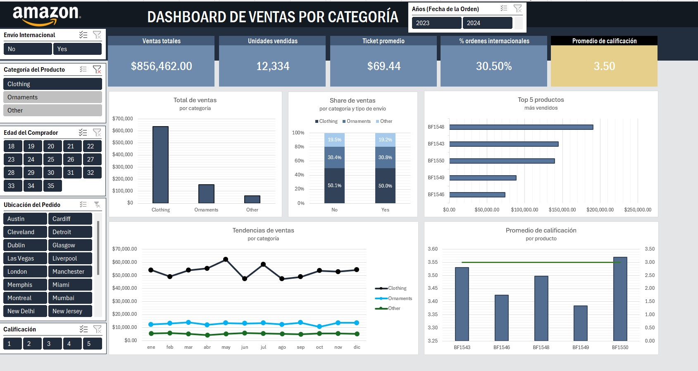
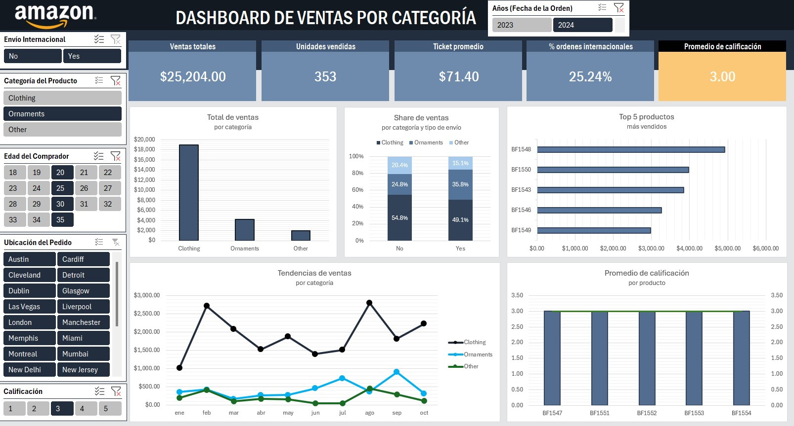
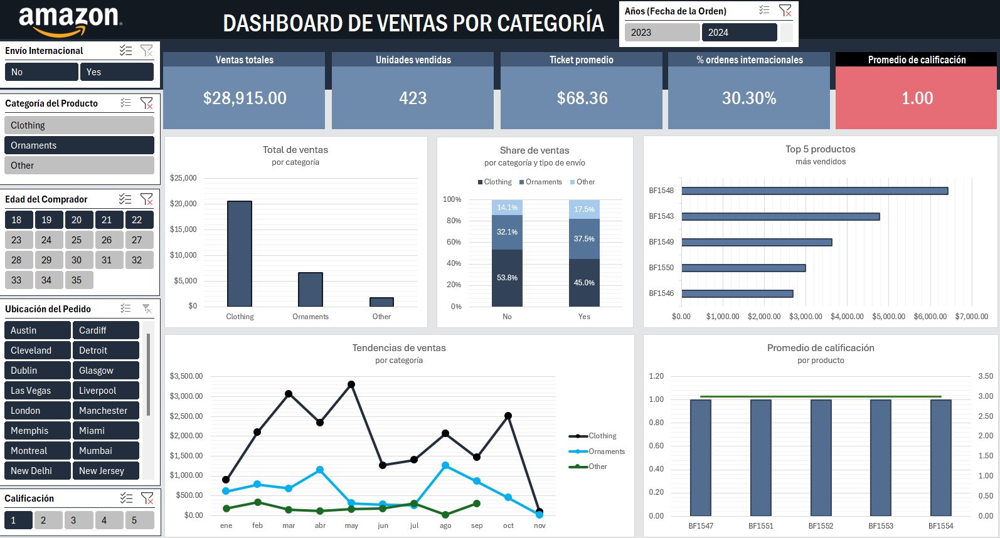

# 📊 Dashboard de Análisis de Ventas  
### Certificación “Data Science Career Path” – Asociación AxMéxico | 2025  

---

## Descripción del proyecto
Este proyecto forma parte de la certificación **Data Science Career Path** (Asociación AxMéxico).  
El objetivo fue diseñar un **dashboard interactivo en Excel** que permitiera analizar las ventas de mercancía por producto, categoría y región, integrando segmentadores y visualizaciones dinámicas.

---

## 🧮 Herramientas utilizadas
- **Excel 365**  
  - Tablas dinámicas  
  - Segmentadores y gráficos vinculados  
  - Medidas personalizadas (porcentajes, totales acumulados)  

---

## 📂 Archivo del dashboard
📊 [Descargar archivo Excel](https://github.com/LuzSantana/Excel-Ejemplo-Dashboard-DataScience/blob/main/Merchandise_Sales_Analysis_Ejercicio%20Luz%20Santana.xlsx)

El archivo incluye hojas con:
- **Base de datos** limpia y estructurada.  
- **Panel interactivo** con métricas clave.  
- **Gráficos dinámicos** filtrables por tipo de producto y periodo.

---
## 📈 Vista previa del dashboard

A continuación se muestran algunas vistas del dashboard interactivo en Excel:

  

  

  

  

---

## 🎓 Créditos
**Autora:** Luz Santana  
**Certificación:** Data Science Career Path – Asociación AxMéxico  
**Fecha:** Noviembre 2025  

---
